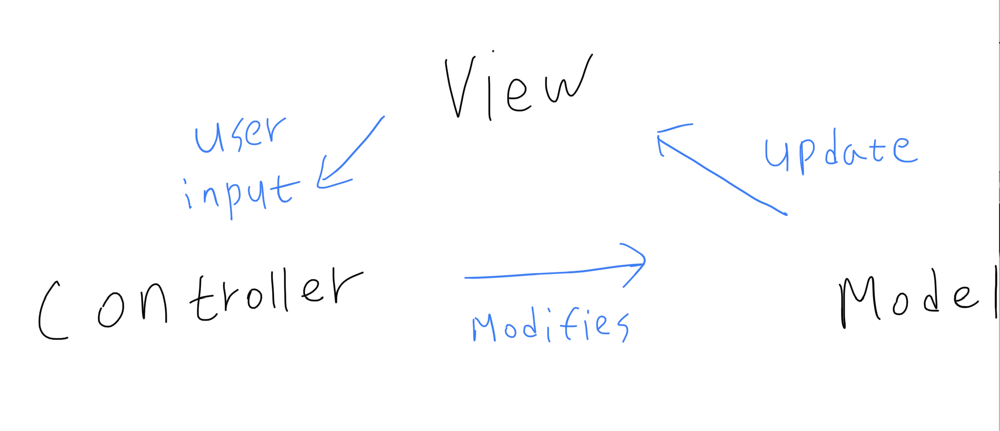

# PWA(Progressive Web App)

## 프로그레시브 웹이란?

- 웹과 네이티브 앱의 이점을 모두 가지고 있는 앱
- 웹 앱은 설치하지 않아도 되는 장점이 있음.
- 네이티브 앱은 설치하여 오프라인에서도 사용할 수 있고, 운영체제와 더 잘 통합됨.
- PWA는 이런 이점을 제공할 수 있는 웹 앱을 생성할 수 있음.

- 요즘 보면 'Xbox Cloud'가 ios App Store에서 금지되서 ios 버전으로 제공하는 웹앱이 이런 형태.

# MVC Pattern (Model-View-Controller Pattern)

- View : 보이는 것
- Controller : 제어하는 것 (읽고, 쓰기)
- Model : 데이터 상태
- 비즈니스 로직과 화면을 구분하는 디자인 패턴
- 장점
  - 유연하고 확장하기 쉽다
- 단점
  - 설계 시간이 오래 걸린다.
  - Model과 View의 완벽한 분리가 어렵다.

# Reference

- https://developer.mozilla.org/ko/docs/Web/Progressive_web_apps/Introduction
- https://facebook.github.io/flux/
