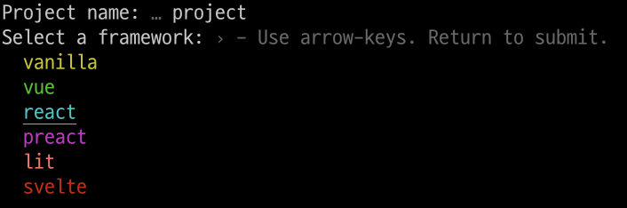

## Vite를 사용하는 이유

- 번들링하는 속도를 빠르게 해서 빠르게 표시

## 템플릿

- vanilla, vue, react, preact, lit, svelte와 TypeScript 템플릿도 제공

## 사용 방법

1. 터미널에 아래와 같이 입력

```
$ npm create vite@latest
$ yarn create vite
$ pnpm create vite
// 중에 하나
```

2. 프로젝트 이름 설정

3. 템플릿 선택



4. 타입스크립트 여부 선택

5. 끝

- 간단하게 설치하고 빠르게 사용할 수 있다.

## Reference

- [https://vitejs.dev/guide/#scaffolding-your-first-vite-project](https://vitejs.dev/guide/#scaffolding-your-first-vite-project)
